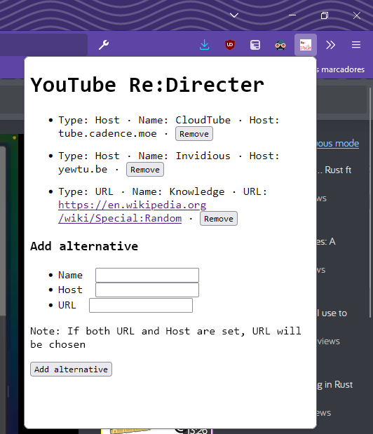

# YouTube ReDirecter

This extension encourages you to use YouTube alternative frontends like [CloudTube](https://sr.ht/~cadence/tube/) or
[Invidious](https://invidious.io/), and allows you to add your own alternatives to the list.

## Examples

## Installation

### From Firefox

1. Go to the latest release, click the ``.xpi`` file and allow GitHub to install the extension

### From other browsers

1. Download the latest ``.xpi`` from the releases page
2. Open Firefox
3. Go to ``about:addons`` and drop the ``.xpi`` file

## Development

Install ``web-ext``

### Build

Run ``web-ext build``
